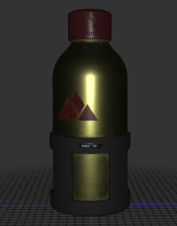

# F3D - Fast and minimalist 3D viewer

By [Kitware SAS](https://www.kitware.eu), 2019

F3D (pronounced `/fɛd/`) is a [VTK-based](https://vtk.org) 3D viewer following the [KISS principle](https://en.wikipedia.org/wiki/KISS_principle), so it is minimalist, efficient, has no GUI,
has simple interaction mechanisms and is fully controllable using arguments in the command line.

It is open-source and cross-platform (tested on Windows, Linux, and macOS).
It supports a range of file formats, rendering and texturing options.

\
*A typical render by F3D*

# Installation

You can find the release binary packages for Windows, Linux, and OSX on the [Release page](https://gitlab.kitware.com/f3d/f3d/-/releases).
Alternatively, you can build it yourself, following the [build guide](#build).

# Build

## Dependencies
* [CMake](https://cmake.org)
* [VTK](https://vtk.org) (optionally with raytracing capabilities to enable OSPray rendering).
* A C++11 compiler
* A CMake-compatible build system (Visual Studio, XCode, Ninja, Make...)

## Configuration and building
Set the following CMake options:
* `VTK_DIR`: Point to a build or install directory of VTK.
* `BUILD_TESTING`: Optionally, enable the tests.
* `MACOSX_BUILD_BUNDLE`: On macOS, build a `.app` bundle.
* `WINDOWS_BUILD_WIN32`: On Windows, build a Win32 application (without console).

Then build the software using your build system.

# File formats

Here is the list of supported file formats:
* **.vtk** : the legacy VTK format
* **.vt\*** : XML based VTK formats
* **.ply** : Polygon File format
* **.stl** : Standard Triangle Language format
* **.dcm** : DICOM file format
* **.nrrd/.nhrd** : "nearly raw raster data" file format
* **.mhd/.mha** : MetaHeader MetaIO file format
* **.gml** : CityGML file format
* **.pts** : Point Cloud file format
* **.obj** : Wavefront OBJ file format (full scene)
* **.gltf/.glb** : GL Transmission Format (full scene)
* **.3ds** : Autodesk 3DS Max file format (full scene)
* **.wrl** : VRML file format (full scene)

# Scene construction

The **full scene** formats (gltf/glb, 3ds, wrl, obj) contain not only *geometry*, but also scene information like *lights*, *cameras*, *actors* in the scene and *textures* properties.
By default, all this information will be loaded from the file and displayed.
For file formats that do not support it, **a default scene** will be provided.

# Options

## Generic Options
Options|Description
------|------
--input=\<file\>|The *input* file or files to read, can also be provided as a positional argument.
--output=\<png file\>|Instead of showing a render view and render into it, *render directly into a png file*.
--no-background|Output file is saved with a transparent background.
-h, --help|Print *help*.
-v, --verbose|Enable *verbose* mode.
--no-render|Verbose mode without any rendering for the first provided file, to recover information about a file.
--version|Show *version* information.
-x, --axis|Show *axes* as a trihedron in the scene.
-g, --grid|Show *a grid* aligned with the XZ plane.
-e, --edges|Show the *cell edges*.
--progress|Show a *progress bar* when loading the file.
-m, --geometry-only|For certain **full scene** file formats (gltf/glb and obj),<br>reads *only the geometry* from the file and use default scene construction instead.
--dry-run|Do not read the configuration file but consider only the command line options

## Material options
Options|Default|Description
------|------|------
-o, --point-sprites||Show sphere *points sprites* instead of the geometry.
--point-size|10.0|Set the *size* of points when showing vertices and point sprites.
--line-width|1.0|Set the *width* of lines when showing edges.
--color=\<R,G,B\>|1.0, 1.0, 1.0| Set a *color* on the geometry.<br>This only makes sense when using the default scene.
--opacity=\<opacity\>|1.0|Set *opacity* on the geometry.<br>This only makes sense when using the default scene. Usually used with Depth Peeling option.
--roughness=\<roughness\>|0.3|Set the *roughness coefficient* on the geometry (0.0-1.0).<br>This only makes sense when using the default scene.
--metallic=\<metallic\>|0.0|Set the *metallic coefficient* on the geometry (0.0-1.0).<br>This only makes sense when using the default scene.
--hrdi=\<file path\>||Set the *HDRI* image used to create the environment.<br>The environment act as a light source and is reflected on the material.<br>Valid file format are hdr, png, jpg, pnm, tiff, bmp.
--texture-base-color=\<file path\>||Path to a texture file that sets the color of the object.
--texture-material=\<file path\>||Path to a texture file that sets the Occlusion, Roughness and Metallic values of the object.
--texture-emissive=\<file path\>||Path to a texture file that sets the emited light of the object.
--emissive-factor=\<R,G,B\>|1.0, 1.0, 1.0| Emissive factor. This value is multiplied with the emissive color when an emissive texture is present.
--texture-normal=\<file path\>||Path to a texture file that sets the normal map of the object.
--normal-scale=\<normal_scale\>|1.0|Normal scale affects the strength of the normal deviation from the normal texture.

## PostFX (OpenGL) options:
Options|Description
------|------
-p, --depth-peeling|Enable *depth peeling*. This is a technique used to correctly render translucent objects.
-u, --ssao|Enable *Screen-Space Ambient Occlusion*. This is a technique used to improve the depth perception of the object.
-f, --fxaa|Enable *Fast Approximate Anti-Aliasing*. This technique is used to reduce aliasing.
-a, --tone-mapping|Enable generic filmic *Tone Mapping Pass*. This technique is used to map colors properly to the monitor colors.

## Camera configuration options:
Options|Description
------|------
--camera-position=\<X,Y,Z\>|The position of the camera. Automaticaly computed or recovered from the file if not provided.
--camera-focal-point=\<X,Y,Z\>|The focal point of the camera. Automaticaly computed or recovered from the file if not provided.
--camera-view-up=\<X,Y,Z\>|The focal point of the camera. Will be orthogonalized even when provided. Automaticaly computed or recovered from the file if not provided.
--camera-view-angle=\<angle\>|The view angle of the camera, non-zero value in degrees. Automaticaly computed or recovered from the file if not provided.

## Raytracing options:
Options|Default|Description
------|------|------
-r, --raytracing||Enable *OSPRay raytracing*. Requires OSPRay raytracing to be enabled in the linked VTK.
--samples=\<samples\>|5|The number of *samples per pixel*. It only makes sense with raytracing enabled.
-d, --denoise||*Denoise* the image. It only makes sense with raytracing enabled.

## Scientific visualization options:
Options|Default|Description
------|------|------
-s, --scalars=\<array_name\>||*Color by a specific scalar* array present in the file. If no array_name is provided, one will be picked if any are available. <br>This only makes sense when using the default scene.<br>Use verbose to recover the usable array names.
--comp=\<comp_index\>|-1|Specify the *component from the scalar* array to color with.<br>Use with the scalar option. Any negative value means *magnitude*.
-c, --cells||Specify that the scalar array is to be found *on the cells* instead of on the points.<br>Use with the scalar option.
--range=\<min,max\>||Set a *custom range for the coloring* by the array.<br>Use with the scalar option.
-b, --bar||Show *scalar bar* of the coloring by array.<br>Use with the scalar option.
--colormap=\<color_list\>||Set a *custom colormap for the coloring*.<br>This is a list of colors in the format `val1,red1,green1,blue1,...,valN,redN,greenN,blueN`<br>where all values are in the range (0,1).<br>Use with the scalar option.
-z, --volume||Enable *volume rendering*. It is only available for 3D image data (vti, dcm, nrrd, mhd files) and will display nothing with other default scene formats.
-i, --inverse||Inverse the linear opacity function. Only makes sense with volume rendering.

## Testing options:
Options|Description
------|------
--ref=\<png file\>|Reference *image to compare with* for testing purposes.
--ref-threshold=\<threshold\>|*Testing threshold* to trigger a test failure or success.

## Window options:
Options|Default|Description
------|------|------
--bg-color=\<R,G,B\>|0.2, 0.2, 0.2|Set the window *background color*.<br>Ignored if *hdri* is set.
--resolution=\<width,height\>|1000, 600|Set the *window resolution*.
-t, --timer||Display a *frame per second counter*.
-n, --filename||Display the *name of the file*.
-y, --field-data||Display the *field data*.<br>This only makes sense when using the default scene.

# Rendering precedence
Some rendering options are not compatible between them, here is the precedence order if several are defined:
- Raytracing (`-r`)
- Volume (`-z`)
- Point Sprites (`-o`)

# Interaction

Simple interaction with the displayed data is possible directly within the window. It is as follows:
* *Click and drag* with the *left* mouse button to rotate around the focal point of the camera.
* Hold *Shift* then *Click and drag* horizontally with the *right* mouse button to rotate the HDRI.
* *Click and drag* vertically with the *right* mouse button to zoom in/out.
* *Move the mouse wheel* to zoom in/out.
* *Click and drag* with the *middle* mouse button to translate the camera.
* Press `Return` key to reset the camera to its inital parameters.
* Press `Escape` key to close the window and quit F3D.
* Press `Left/Right` to load the next/previous file if any
* Drag and Drop a file to load it

Some options can be toggled directly using interactions:
* Press `x` key to toggle the trihedral axes display.
* Press `g` key to toggle the XZ grid display.
* Press `e` key to toggle the display of cell edges.
* Press `s` key to toggle the coloration by scalar.
* Press `b` key to toggle the display of the scalar bar, only when coloring with scalars.
* Press `t` key to toggle the display of the FPS counter.
* Press `n` key to toggle the display of the file name.
* Press `y` key to toggle the display of the field data if exists.
* Press `r` key to toggle raytracing.
* Press `d` key to toggle the denoiser when raytracing.
* Press `p` key to toggle depth peeling.
* Press `u` key to toggle Screen-Space Ambient Occlusion.
* Press `f` key to toggle Fast Approximate Anti-Aliasing.
* Press `a` key to toggle tone mapping.
* Press `o` key to toggle point sprites rendering.
* Press `l` key to toggle full screen.
* Press `?` key to toggle the display of a cheat sheet showing all these hotkeys and their statuses.

# Configuration file

All the command-line options can be controlled using a configuration file.
This configuration file uses the "long" version of the options in a JSON
formatted file to provide default values for these options.

These options can be organized by block using a regular expression for each block
in order to provide different default values for the different filetypes.

Using a command-line option will override the corresponding value in the config file.
A typical config file may look like this :

```javascript
{
   ".*": {
       "resolution": "1200,800",
       "bg-color": "0.7,0.7,0.7",
       "color": "0.5,0.1,0.1",
       "fxaa": true,
       "timer": true,
       "progress": true,
       "axis": true,
       "bar": true,
       "verbose": true,
       "roughness": 0.2,
       "grid": true
   },
   ".*vt.": {
       "edges": true
   },
   ".*gl[tf|b]": {
       "raytracing": true,
       "denoise": true,
       "samples": 3
   },
   ".*mhd": {
       "volume": true
   }
}
```
This first block defines a basic configuration with many desired options for all files.
The second block specifies that all files ending with vt., eg: vtk, vtp, vtu, ... will be shown with edges on.
The third block specifies raytracing usage for .gltf and .glb files.
The last block specifies that volume rendering should be used with .mhd files.

The configuration file possible locations depends on your operating system.
They are considered in the below order and only the first found will be used.
 * Linux : `/etc/f3d/config.json`, `[install_dir]/config.json`, `${XDG_CONFIG_HOME}/.config/f3d/config.json`, `~/.config/f3d/config.json`
 * Windows : `[install_dir]\config.json`, `%APPDATA%\f3d\config.json`
 * MacOS : `/etc/f3d/config.json`, `f3d.app/Contents/Resources/config.json`, `[install_dir]/config.json`, `~/.config/f3d/config.json`

If you are using our release, a default configuration file will be installed when installing F3D.
On Linux, it will be installed in /etc/f3d/, on Windows, it will be installed in the install directory, on MacOS, it will be installed in the bundle.

# Limitations

* No support for animation.
* No support for specifying manual lighting in the default scene.
* Drag&Drop does not work with Thunar file manager.
* Pressing the `t` hotkey to display the FPS timer triggers a double render.

# Troubleshootings

## General
> I have built F3D with raytracing support but the denoiser is not working.

Be sure that VTK has been built with *OpenImageDenoise* support (`VTKOSPRAY_ENABLE_DENOISER` option).

## Windows
> I have installed F3D using the provided installer but when launched, I have an error with unfound DLL libraries.

You need to install [Visual C++ Redistributable for Visual Studio 2015](https://www.microsoft.com/en-us/download/details.aspx?id=48145), select the `x64` version.

> I use F3D in a VM, the application fails to launch

OpenGL applications like F3D can have issues when launched from a guest Windows because the access to the GPU is restricted.\
You can try to use a software implementation of OpenGL, called [Mesa](https://github.com/pal1000/mesa-dist-win/releases).\
Download the lastest `release-msvc` and copy `OpenGL.dll` in the same folder than `f3d.exe`.
